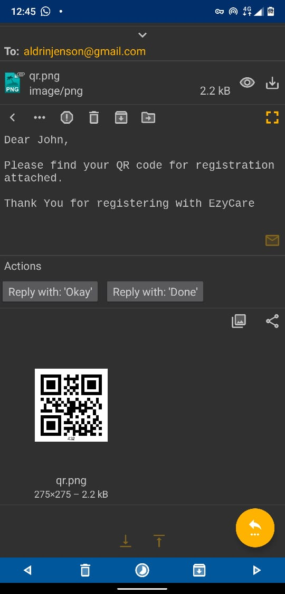
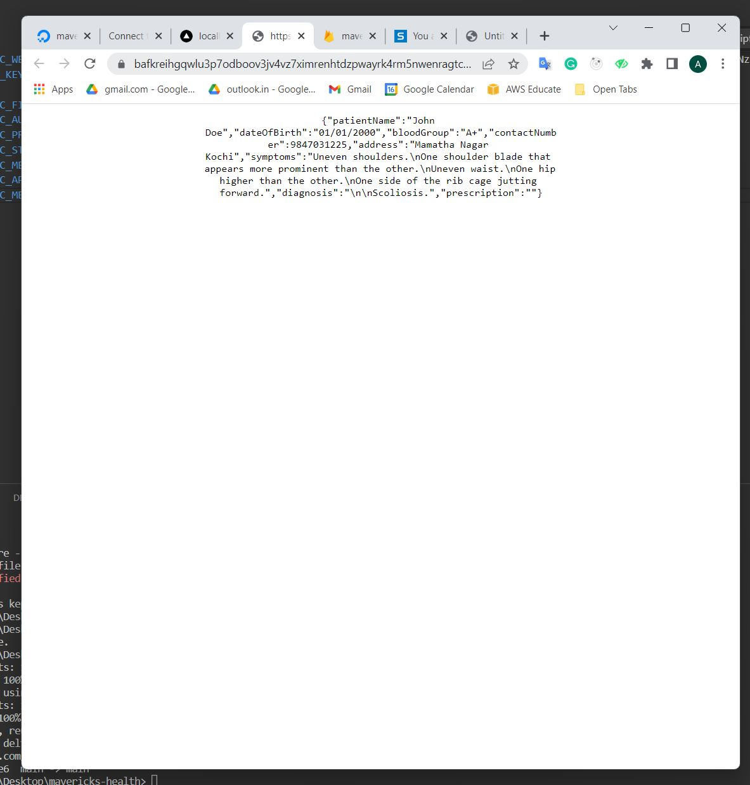
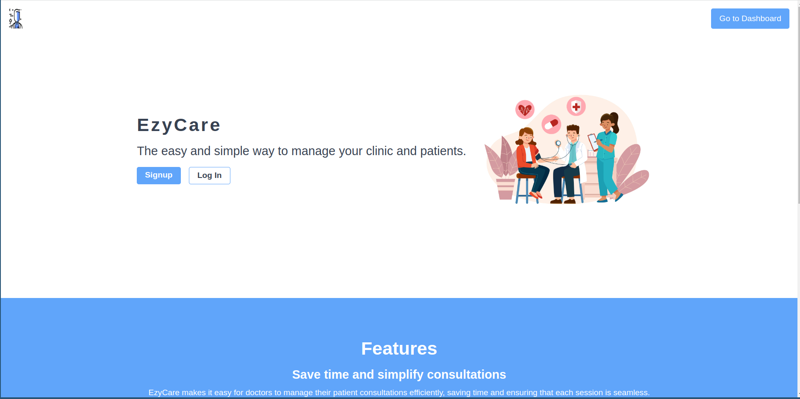

# EzyCare - AI Diagnosing + Easy Medical Consultancy management

The easy and simple way to manage your clinic and patients.

## Problems based in current industry

- Visiting a doctor is time consuming. Often taking up half to a whole day
- Patients often will have to wait in long queues to see doctors because it takes too much time per patient
- Doctors resort to writing down symptoms and diagnosis in papers which is too slow
- The chart of case history of patients could get lost or decayed over time
- Really difficult by doctors to referrence past cases
- There has been cases when a doctor made wrong  diagnosis and put patient's lives at risk

We solve all these problems using our solution

## The Problem It Solves
The web app for patient consultations solves the problem of inefficient and time-consuming patient consultations by providing a range of features to streamline the process. The app helps physicians to save time and make the consulting process with patients easy, while also ensuring efficiency, security, and privacy. It offers a range of tools, including the 
- ability to manage registrations using QR codes and images, 
- store sensitive records in a decentralized blockchain , 
- generate reports of sessions, and easily search through past cases. 
- The app also incorporates AI technology to provide diagnosis suggestions and offers a speech-to-text feature that allows physicians to quickly input symptoms and receive AI-generated diagnoses. By addressing these challenges and providing a comprehensive suite of tools, the app enables physicians to deliver better, more effective patient consultations in less time.
- send emails(fully implemented) + SMS(future plan) when a patient visits the clinic for the first time
- No need to carry around papers each time with past case history
- Patient can generate pdf report when necessry of necessary diagnosis
- Really efficient for doctors

## Challenges We Ran Into
- Speech recongition
- incorporating filecoin

## Technologies We Used
- IPFS
- FileCoin
- DigitalOcean
- TailwindCSS
- Replit
- Web3Storage
- NextJS
- Firebase
- NodeMailer
- Flask

## Target Audience
- Doctors
- Personal Clinic owners

## Revenue Model

- SAAS - Subscription based offerrings
- Add-On feature for voice-to-text for existing EHR management softwares
- Maintenance costs(lifelong)
- Pro Plans for even more features like complete EHR system with multiple doctors support
- Admin views for small to large medical businesses

## Images

## Links
- https://mavericks-health-pwemh.ondigitalocean.app/  
- https://github.com/alapanoski/mavericks-health
- https://github.com/alapanoski/mavericks-health-flask-backend
- https://www.loom.com/share/97c05fea5ca647a0987f55a900dc7141
- https://mavericks-health-pwemh.ondigitalocean.app/

